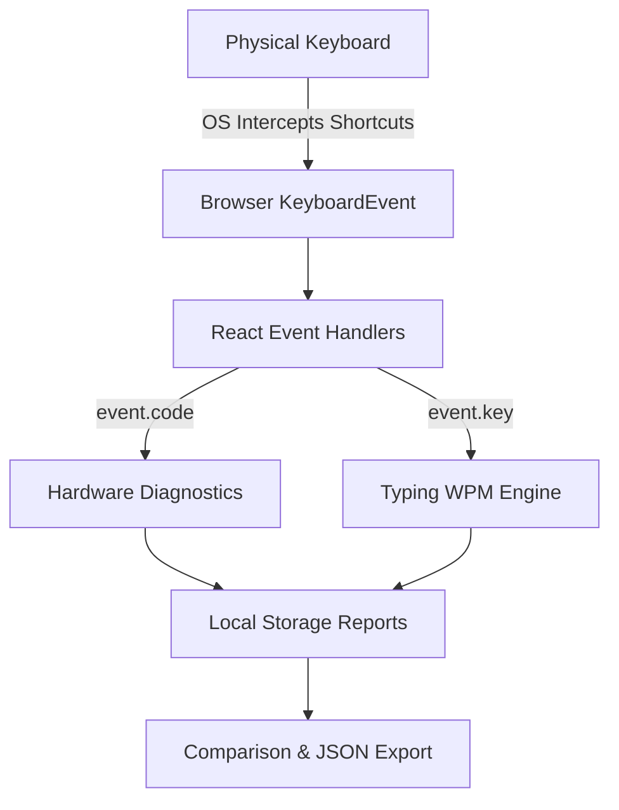

# KeyCheck ⌨️

KeyCheck is a comprehensive, production-ready, client-side web application for diagnosing, testing, and comparing physical keyboard hardware. Built with React 19, Vite, and Tailwind CSS v4, it provides immediate visual and statistical feedback on hardware key events without compromising user privacy.

## Features & Capabilities

- **Diagnostic Layout Testing**: Test QWERTY, AZERTY, and QWERTZ keyboards. Identifies physical keystrokes using the underlying `KeyboardEvent.code` to bypass OS language mappings, ensuring hardware-level accuracy.
- **Multi-Key Ghosting Test**: Measure your keyboard's hardware rollover constraints (N-Key Rollover / KRO). Tracks simultaneous keystrokes precisely as the browser receives them.
- **Advanced Typing Engine**: Calculates strict WPM and accuracy using `KeyboardEvent.key`. Fully supports Unicode and complex character inputs (Emoji, Devanagari, Arabic, CJK) via mathematically correct grapheme segmentation (`Intl.Segmenter`).
- **Global Internationalization (i18n)**: 16 supported languages out-of-the-box. Features dynamic Right-to-Left (RTL) layout switching (Arabic/Hebrew) using CSS logical properties (`ps-`, `text-start`), while strictly enforcing Left-to-Right (`dir="ltr"`) on the physical keyboard visualizer to match real-world hardware.
- **Keyboard Comparison**: Save diagnostic sessions and compare two separate hardware keyboards side-by-side to identify coverage gaps or dead zones.
- **Event Inspector**: Low-level, developer-friendly diagnostic view exposing raw browser keyboard events, modifier states, and timing anomalies.
- **Zero-Telemetry Privacy**: The architecture guarantees that your keystrokes are **never** transmitted over the network. All session tracking occurs exclusively in your local browser storage (`localStorage` & `sessionStorage`).
- **Dynamic Theming**: Light, Dark, and System (`prefers-color-scheme`) theme integration natively built using Tailwind's semantic design tokens.
- **Fluid Responsiveness**: Uses modern CSS Container Queries (`@container`, `cqw`) to dynamically scale the keyboard visualization flawlessly across desktop, tablet, and mobile displays without horizontal scrollbars.

---

## 🏗️ Architecture

KeyCheck is a static Single Page Application (SPA). The backend folder contains a trivial Express health-check node designed strictly for uptime monitoring during deployment, and plays no part in the core testing logic.



### Why separate `event.code` and `event.key`?
Browsers obscure direct electrical access to keyboard hardware.
- **`event.code`**: Identifies the physical key switch (e.g., `KeyQ` is always the key next to Tab). Used for hardware health testing.
- **`event.key`**: Identifies the linguistic character interpreted by the OS (e.g., `q` or `a`). Used for the Typing Test.

---

## 🚀 Local Development

Ensure you have Node.js installed.

```bash
# Clone the repository
git clone https://github.com/Vedant-S-Tattimani/keyboard-tester.git

# Enter the frontend workspace
cd keyboard-tester/frontend

# Install dependencies
npm install

# Start the Vite development server
npm run dev
```

---

## 🧪 Testing

KeyCheck utilizes an isolated testing architecture to prevent configuration bleeding between Unit and End-to-End tests.

- **Unit Tests**: `npm run test` (Vitest + React Testing Library + jsdom)
- **E2E Tests**: `npm run test:e2e` (Playwright Chromium)

---

## 🔒 Security & Privacy

1. **Zero External Logging**: No error tracking software (e.g., Sentry) or analytics software (e.g., Google Analytics) is configured that might inadvertently leak keystroke payloads.
2. **CORS Restrictions**: API requests (if ever expanded) are locked down strictly via the `CLIENT_URL` environment variable.
3. **DOM Safety**: We exclusively use React's standard XSS-safe DOM bindings. The Event Inspector completely avoids `dangerouslySetInnerHTML`.

---

## 🌍 Platform Constraints & Browser Limitations

KeyCheck visualizes the keys your browser receives. It **cannot** test keys that the Operating System refuses to pass to the browser:
- `Fn` (Function modifier) is strictly handled by firmware/kernel.
- `Windows/Super` keys are often trapped by the OS start menu.
- `Alt+Tab` / `Cmd+Tab` are OS-level window management shortcuts.
- Browser specific shortcuts (`Ctrl+T` new tab) might preempt Javascript listeners.

*Note: Ghosting failures might indicate hardware limits, or simply USB/Bluetooth transmission constraints.*

---

## 📜 License & Contribution

This project is open-source under the **MIT License**. 
Please refer to `CONTRIBUTING.md` for guidelines on adding new locales or keyboard layouts.
